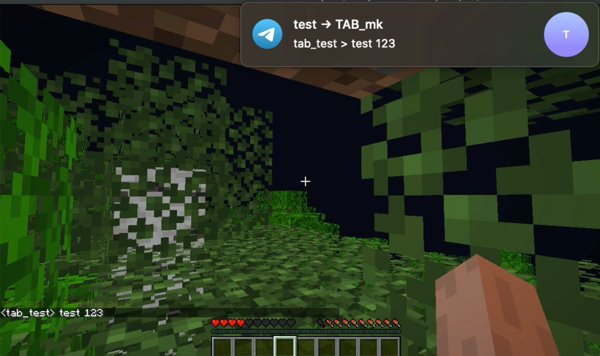

# WIP

__AnyBridge__ currently working only in one way `Minecraft > GET request`

But even now you can link your chat to vkontakte, telegram or your web-server

<p align="center">
  
</p>

### Install

- Download AnyBridge.jar from [releases page](https://github.com/TABmk/AnyBridge/releases)
- put in `/plugins` folder
- restart server

### Commands

There is only one command - `/abreload`

If you edited your config, you can update it in game

### Config

Default config:
```
handleMessages: true
handleCommands: true
messageFormat: '%USER% > %TEXT%'
links:
  chat:
    enable: false
    link: 'http://localhost:3000/send?text=%TEXT%'
  vk:
    enable: false
    link: 'https://api.vk.com/method/messages.send?access_token=YOUR_TOKEN&peer_id=99999&random_id=%RND%&message=%TEXT%&v=5.124'
  telegram:
    enable: true
    link: 'https://api.telegram.org/bot123:TOKEN/sendMessage?chat_id=99999&text=%TEXT%'
```

- `handleMessages` if true sending all messages
- `handleCommands` if true sending all commands
- `messageFormat` is general message format. You can set per link format by adding `format` key to link object.
- `links` Object of links. You can add as many as you want
- `links.x.enable` is link working
- `links.x.link` your link, plugin will make GET request to it. (Only HTTP/S are allowed)
- `links.x.format` custom format for link, general format will be ignored

##### Placeholders
`messageFormat` and `links.x.format`:
- `%USER%` for nickname
- `%TEXT%` for message

`links.x.link`:
- `%TEXT%` formatted message
- `%RND%` random int 0-999998. (vk.com random int for each message, for example)

### Usage
You can use it for sending messages from in-game chat to chats in messengers, make live chat on site, logging chat somewhere or make custom checks on site's backend (perform action on site if user executed correct command or sent message)

### How to link
Many messengers or social media have simple API based on GET requests. So, you can find in documentation base url, add method path, set your chat id in params and set text to %TEXT%

If you want link game chat to place which can't be currently linked with AnyBridge, you can make simple web-server on any language you know and receive messages via GET request from plugin. And then send anywhere you need.

##### Popular list (WIP)
|Name|Documentation|Example|
|---|---|---|
|VK.com|[Link](https://vk.com/dev/messages.send)|`https://api.vk.com/method/messages.send?access_token=TOKEN&peer_id=1&random_id=%RND%&message=%TEXT%&v=5.124`|
|Telegram|[Link](http://telegram.org/bots/api#sendmessage)|`https://api.telegram.org/TOKEN/sendMessage?chat_id=1&text=%TEXT%`|

### TODO
- [ ] Add POST support first of all
- [ ] WS/S support maybe
- [ ] Add web-server examples
- [ ] Make spigot page
- [ ] Add backward support for services, like modules for callback/longpoll maybe
